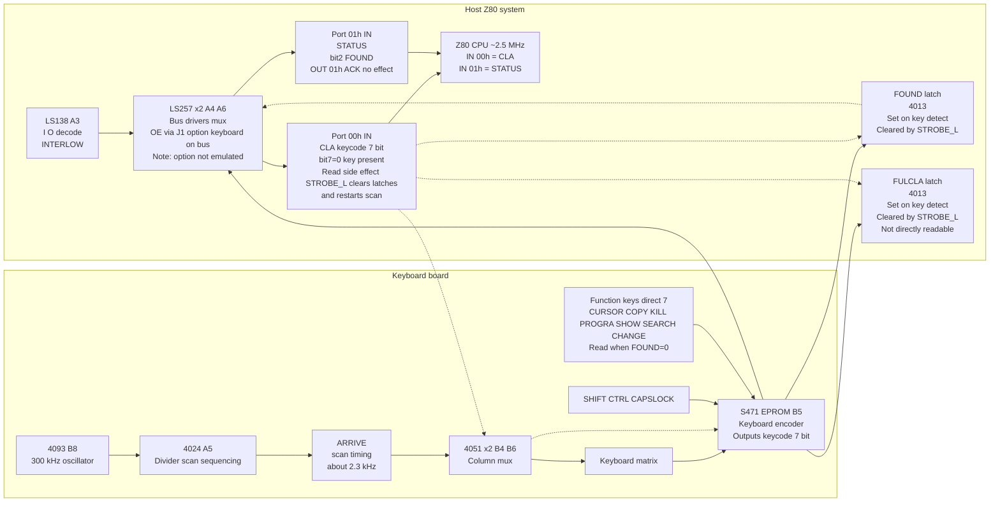
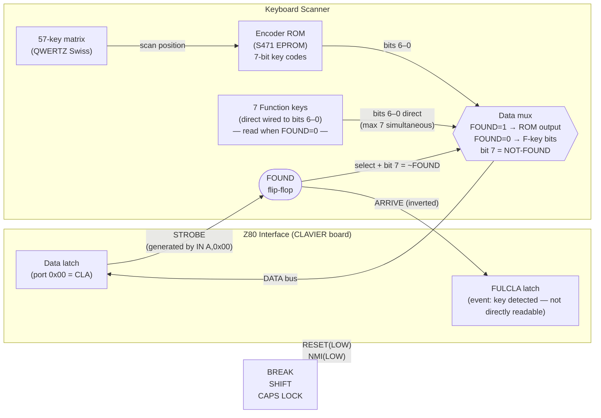

# Smaky 6 — Hardware Reference for FPGA Recreation

*Based on nine original Epsitec schematics and documents (J. Zahn November 1978,
R. Forster October 1979) and reverse-engineering of the SAMOS 2-8 ROM images.*

Reading guide:

- Sections that describe boards, chips, buses, memory ranges, and port wiring are
  intended as stable hardware reference material.
- Subsections explicitly labeled `emulator mapping` describe the current Smemu6
  implementation choice for presenting or approximating that hardware.
- Dated runtime-audit notes record how emulator behavior was checked against the
  available evidence. They are kept as provenance, but they should not be read as
  stronger than the underlying schematic or ROM evidence.

---

## Table of Contents

1. [Overview](#1-overview)
2. [CPU Subsystem](#2-cpu-subsystem)
3. [Memory Subsystem](#3-memory-subsystem)
4. [Display Subsystem](#4-display-subsystem)
5. [Keyboard Interface](#5-keyboard-interface)
6. [I/O Port Map](#6-io-port-map)
7. [Floppy Controller](#7-floppy-controller)
8. [Winchester Controller](#8-winchester-controller)
9. [Serial Interfaces (USART)](#9-serial-interfaces-usart)
10. [Parallel Interface](#10-parallel-interface)
11. [Sound / Buzzer](#11-sound--buzzer)
12. [Interrupt Architecture](#12-interrupt-architecture)
13. [Boot Sequence (Phantom ROM)](#13-boot-sequence-phantom-rom)
14. [Signal Glossary](#14-signal-glossary)
15. [FPGA Implementation Notes](#15-fpga-implementation-notes)

---

## 1. Overview

The **Smaky 6** is a Swiss Z80-based personal computer designed at EPFL (Lausanne)
by Jean-Daniel Nicoud and commercialized by Epsitec (~450 units, 1979–1983).

The machine is organized on a **backplane with plug-in boards**:

- `PROCESSEUR`: doc-227 (J. Zahn, Nov 1978). Z80, clock, 8251 USARTs, NMI, bus control.
- `MÉMOIRE`: doc-228 (J. Zahn, Nov 1978). DRAM banks, ROM sockets, address decode.
- `AFFICHAGE`: doc-229 (J. Zahn, Nov 1978). Scan counters, pixel clock, DMA HOLD logic.
- `CARACTÈRES`: doc-230 (J. Zahn, Nov 1978). Char-gen, serializers, line buffers, parallel.
- `Ext. board`: doc-230-memext (R. Forster, Oct 1979). 32K DRAM, Phantom ROM, RTC, and SIRING.
- `CLAVIER`: doc-231 (J. Zahn, Nov 1978). Keyboard scan matrix, encoder (S471), counters.
- `Floppy ctrl`: doc-189-191 (3 sheets). Micro-floppy serialisation, decode, and IRQ.
- `Par. I/O`: doc-219-225 (J. Zahn, 7 pp). Parallel interface description and port map.

Hardware versions:

- **32 KB model** — 2 × 8 × 4116 DRAM on mainboard; fixed SYSMON + SAMOS ROMs at 0x0000–0x1FFF.
- **48 KB model** — as above plus one extra DRAM bank.
- **64 KB Phantom model** — mainboard 32 KB DRAM plus an **extension board** (32 KB DRAM,
  2 KB Phantom ROM, RTC, and SIRING connector); single 2 KB Phantom bootstrap ROM at
  0x0000–0x07FF that bank-switches itself out after loading the OS from floppy.
  *This is the variant documented and emulated here.*

---

## 2. CPU Subsystem

### 2.1 Processor

- `CPU`: Zilog Z80 (NMOS, 40-pin DIP).
- `Clock`: **12.0576 MHz** crystal divided by 5 gives **2.4115 MHz**.
  Rounded in documentation to **2.5 MHz**.
- `T-states / frame`: 50,000 (2.5 MHz ÷ 50 Hz).
- `Interrupt mode`: **IM 0**; never changed by Phantom ROM or SAMOS.
- `Reset`: power-on plus RESET signal from the front panel.

The 12.0576 MHz master oscillator is also the pixel clock for the video
subsystem (see §4).  The CPU clock is derived by a divide-by-5 prescaler on the
PROCESSEUR board; confirmed by schematic annotation.

### 2.2 Bus control signals

- `HOLDAL` (pin 31, to CPU): BUSREQ from the display board (`AFFICHAGE`); steals bus cycles for DMA.
- `HOLDBL` (pin 33, to CPU): second BUSREQ source, reserved or Winchester-related.
- `HOLDA` (pin 30, from CPU): BUSACK; display board gets the bus when asserted.
- `NMILOW` (pin 17, to CPU): active-low NMI, driven by BREAK key and floppy sector sensor.
- `INTREDYLOW` (pin 21, to CPU): INT from the display frame timer, the 50 Hz `RST 38h` source.
- `INTRECLOW` (pin 23, to CPU): INT from USART data-ready; not used by SAMOS 2-8.
- `RESETL` (pin 26, to CPU): power-on or front-panel RESET.
- `PETRIL` (pin 36, to CPU): WAIT; not used in the standard configuration.
- `MREQL` (pin 19, from CPU): memory request.
- `IORL` (pin 20, from CPU): I/O request.
- `WRL` (pin 22, from CPU): write strobe.
- `M1L` (pin 27, from CPU): opcode fetch or INT acknowledge.
- `RFSH` (pin 28, from CPU): DRAM refresh, fed to the RAS logic on the `MÉMOIRE` board.

The display board asserts `HOLDAL` during every horizontal blanking period to
fetch one byte from video RAM, keeping the screen populated without CPU
involvement.  This causes up to ~8 stolen T-states per scan line.  The emulator
does not model stolen cycles (effect on timing is negligible at 2.5 MHz).

---

## 3. Memory Subsystem

### 3.1 Address map (64 KB Phantom model)

Addresses confirmed in **octal** on the MÉMOIRE schematic:
`040000` = 0x4000, `046000` = 0x4600, `100000` = 0x8000.

- `0x0000–0x07FF` (`000000–003777`): 2 KB. **Phantom ROM** (TMS2716 EPROM, `SYS17`).
  Becomes writable RAM after `OUT (01h), A=00h`.
- `0x0800–0x3FFF` (`004000–037777`): about 14 KB of lower RAM; SAMOS OS is loaded here from floppy.
- `0x4000–0x44FF` (`040000–042377`): 1280 B. **Alpha (text) framebuffer**, 20 rows × 64 columns.
- `0x4500–0x45FF` (`042400–042777`): 256 B. SAMOS OS workspace, including CLI buffer and current filename.
- `0x4600–0x54FF` (`043000–052377`): 3840 B. **Graphic framebuffer**, 60 rows × 64 bytes.
- `0x5500–0x77FF` (`052400–073777`): about 8 KB of `SYS.SY` code loaded by Phantom from floppy.
- `0x7800–0xFFFF` (`076000–177777`): about 32 KB of upper RAM.

### 3.2 DRAM (MÉMOIRE board)

- `DRAM chips`: Intel 4116, 16 devices, each `16K × 1-bit`.
- `Bank 1 (E20–E27)`: `8 × 4116`, for 16 KB.
- `Bank 2 (F20–F27)`: `8 × 4116`, for 16 KB.
- `Total`: **32 KB** on the initial revision.

The 4116 requires **three supply voltages**: +12 V, +5 V, −5 V.  Address
multiplexing (RAS/CAS) is handled by LS 158 multiplexers (F19, E19) on the
MÉMOIRE board.  The Z80 `RFSH` signal is fed to the RAS logic for the mandatory
refresh cycles.

Upper RAM (0x8000–0xFFFF) is provided by the memory extension board (§3.5).

### 3.3 ROM (MÉMOIRE board)

The right-hand section of the MÉMOIRE board carries four EPROM sockets
**C21–C24**, accepting either **2708** (1 KB) or **2716 / TMS2716** (2 KB) chips.
A jumper selects whether the ROM block maps to **0x4000 or 0x6000**.
On the 64 KB Phantom variant the only populated socket is the single
2 KB Phantom bootstrap at **0x0000**.

ROM chip-select is generated by an **LS 138** (D20) decoding A11–A13.

### 3.4 Address decode (MÉMOIRE board)

Two cascaded **LS 139** demultiplexers (E17, top; E17, bottom) decode A14–A15
into four 16 KB quadrant-selects:

- `A15 A14 = 0 0`: `0000–3FFF`, lower RAM or ROM.
- `A15 A14 = 0 1`: `4000–7FFF`, video and OS.
- `A15 A14 = 1 0`: `8000–BFFF`, upper RAM.
- `A15 A14 = 1 1`: `C000–FFFF`, upper RAM.

The `MOVROM` signal (latched by D18/D19 flip-flop on receipt of
`OUT (01h), A=00h`) disables the Phantom ROM chip-select, exposing the
underlying RAM at 0x0000–0x07FF.

### 3.5 Memory Extension Board (64 KB Phantom model)

*Confirmed from Epsitec schematic: "Extension mémoire 32K RAM dynamique + 2K EPROM /
Horloge absolue + SIRING 7910", designed by Ronald Forster, Epsitec, October 1979.*

In the 64 KB Phantom model the mainboard ROM sockets (C21–C24) are **unpopulated**.
All ROM and the upper 32 KB of RAM live on this plug-in extension board.

- `IC1`: TMS2716, one device. **Phantom ROM**, 2 KB EPROM at `0x0000–0x07FF`.
- `IC16–IC31`: 4116 DRAM, 16 devices. **Upper 32 KB RAM** at `0x8000–0xFFFF`.
- `IC5`: `E405/08`, one device. **RTC** (`Horloge absolue`), chip `E405`, port `0x08`, serial at 32.768 kHz.
- `IC2`, `IC10`: LS158, two devices. Row/column address mux for DRAM.
- `IC3`: half LS139, one device. RAS or bank decoder.
- `IC8`: S287, one device. Extension bus interface and address decode.
- `IC11`: 81LS95, one device. Octal tri-state data-bus driver.
- `IC14`, `IC15`: C175, two devices. Quad D latches for DRAM data-line buffers.
- Crystal: 32 kHz XTAL, one device, for the RTC.
- Battery: 1.5 V cell, one device, for RTC backup.

**Phantom ROM (IC1)**: The TMS2716 EPROM is on this board, not the mainboard.
Its chip-select (`sel0`) is driven by IC8 (S287) and is disabled when the
Z80 executes `OUT (01h), A=00h` (MOVROM), exposing the underlying RAM.

**DRAM (IC16–IC31)**: 16×4116 = 32 KB at 0x8000–0xFFFF.
RAS/CAS multiplexing by IC2/IC10 (LS158 MUX), bank select by IC3 (LS139).
Refresh driven by the Z80 `RFSH` / `REFRESH` signal from the mainboard bus.

**RTC — E405/08 (IC5)**: 3-wire synchronous serial interface.

The E405 is a **custom RTC ASIC manufactured by Micro Electronic Marin (MEM)**,
a Swiss company based in Le Locle/Marin-Epagnier.  It was one of the earliest
real-time clock chips produced for personal computers.
*(Information courtesy M. Pierre-Yves Rochat.)*

The slash notation `E405/08` is an Epsitec schematic convention used by
R. Forster: the part before the slash is the **chip type** (E405) and the
number after the slash is the **I/O port address** (0x08).  Port 0x08 is
therefore directly encoded in the component designator.

**Important distinction:** J. Zahn's schematics also use E-prefixed identifiers
(e.g. E17 = LS 139, E9 = 2101 SRAM, E11 = 2101 SRAM) but these are **board
grid coordinate references** — the letter denotes the row and the number
denotes the column on the backplane layout.  They do **not** encode any I/O
port address.  Only R. Forster's extension board uses the `ChipType/PortAddr`
slash notation.  **E405/08 (IC5) is the only such chip across all nine
schematics.**

Serial interface (3-wire synchronous bit-bang, proprietary — predates SPI):

- **CK** — serial clock (toggled by Z80 I/O write)
- **I/O** — bidirectional data line (MOSI on write, MISO on read)
- **CS** — implicit chip-select (bits 1–2 held high during a transaction)

Protocol: 4-bit command phase (LSB-first), then 7 BCD data bytes (LSB-first per
byte).  Command 0b1111 (0x0F) = read; 0b0111 (0x07) = write.

Register layout (7 bytes, BCD, confirmed empirically from SAMOS display):

- Byte 0: `hours`, range `00–23`, SAMOS field `hh`.
- Byte 1: `minutes`, range `00–59`, SAMOS field `mm`.
- Byte 2: `day`, range `01–31`, SAMOS field `DD`.
- Byte 3: `month`, range `01–12`, SAMOS field `MM`.
- Byte 4: `year`, range `00–99`, SAMOS field `YY`.
- Byte 5: `weekday`, range `1–7`, day name where `1=Mon` and `7=Sun`.
- Byte 6: `seconds`, range `00–59`, SAMOS field `ss`.

**SIRING / 7910**: The board title suffix "SIRING 7910" is the Epsitec
internal board designation. "7910" is the date code (October 1979).
The meaning of "SIRING" is not confirmed from available sources.

**Bus connectors**: The board uses ADPER (B22) and ADMEN (B21/B15/B14)
for address bus connections, plus REFRESH (A21), WRITE (A16/A30), NODA (B20),
and RESET (A20).

---

## 4. Display Subsystem

### 4.1 Architecture

The display is driven by two independent hardware planes that share the same
Z80 address space.  A dedicated scan-counter board (AFFICHAGE, sheet 11-1)
generates composite video without CPU intervention using **DMA HOLD cycles**.

- `Alpha`: `0x4000–0x44FF`, character codes (ASCII, 7-bit).
- `Graphic`: `0x4600–0x54FF`, bitmap pixels (1 bpp).

Display modes are set by `OUT (00h), A`:

- `0x01` (`ALPHA`): text only, alpha plane.
- `0x0D` (`GRAPHIC`): bitmap only, suppress alpha.
- `0x0F` (`GRAPHIC+P`): bitmap plus small-points mode.
- `0x05` (`SUPER`): superimposed alpha plus graphic.
- `0x07` (`SUPER+P`): superimposed plus small-points.
- `0x00` (`OFF`): display blanked.

Port 0x00 bit encoding:

- bit 0 = ENALPHA/display enable
- bit 1 = small-points ('P') mode
- bit 2 = ENGRA (graphics layer active)
- bit 3 = graphics-only (suppress alpha)

### 4.2 Alpha (text) plane

- `Columns`: 64.
- `Rows`: 20.
- `Cell size`: 8 × 8 pixels, displayed as 8 px wide × 8 px tall.
- `Character ROM`: **74S262** plus **2716 EPROM** (2 KB, 128 chars × 16 bytes).
- `Character set`: 7-bit ASCII; the audited S471 ROM provides a lowercase normal layer and an uppercase caps layer. Power-on state is the lowercase normal layer (confirmed on the real machine 2026-08-25).
- `Bit order`: bit 0 is the leftmost pixel, LSB-first.
- `Total buffer`: 1280 bytes at `0x4000`.

The character generator is a two-stage pipeline: a **74S262** parallel-load
shift register serializes the 8 pixel bits from the 2716, then a second
serializer (also on the CARACTÈRES board) feeds the analog CRT.

**GROS signal**: a hardware double-width character mode exists (GROS = "big"
in French) but is not used by SAMOS 2-8 and is not emulated.

### 4.3 Graphic (bitmap) plane

- `Logical rows`: **60**, stored rows in RAM.
- `Bytes per row`: 64.
- `Total bytes`: 3840 (`60 × 64`) at `0x4600–0x54FF`.
- `Pixel encoding`: **nibble-interleaved**. High nibble is the even scan line; low nibble is the odd scan line.
- `Bit order`: bit 3 of the nibble is the leftmost pixel, **MSB-first** within each nibble.
- `Native size`: 256 × 120 px (`64 bytes × 4 px/nibble = 256` wide; `60 pairs × 2 lines = 120` tall).
- `Display size`: 512 × 480, with 2× horizontal and 4× vertical stretch.
- `Pixel aspect`: about 1:1 on output; square pixels at 2× stretch match the original CRT's approximate 4:3 frame.

**Why 60 byte-pairs?**  The AFFICHAGE scan counter counts 240 active lines.  The DMA
address counter increments once every 2 lines (not 4), giving 120 unique line addresses
but only 60 unique RAM addresses (each address feeds both an even and an odd line via
the nibble split). Each 64-byte row is read twice (high nibble, then low nibble).

**Superimpose**: when both planes are active (SUPER mode), the graphic pixel
takes priority over the alpha character where the graphic bit = 1; the alpha
character shows through where the graphic bit = 0.

### 4.4 Timing (AFFICHAGE board)

- `Pixel clock`: **12.0576 MHz**, the master crystal.
- `Pixels per line`: 512 active plus about 88 blanking, 600 total.
- `Line rate`: `12.0576 MHz ÷ 600 ≈ 20.1 kHz`.
- `Active lines`: 240.
- `Frame rate`: **50 Hz**, matching PAL-region CRT sync.
- `Lines per frame`: about 401 (`240 active + ~161 V-blank`).
- `Phosphor`: **P31 green**, peak emission around 530 nm.

The scan counter board generates the `HOLDAL` signal once per pixel clock
period during H-blank to steal one bus cycle and fetch the next character/bitmap
byte.  Two **Intel 2101** static-RAM line buffers are used as pipeline latches
so the CRT DAC stream is continuous even when the CPU holds the bus.

### 4.5 SDL2 rendering (emulator mapping)

```text
Physical pixel buffer : 512 × 240 (1 bpp → ARGB8888)
Lit pixel colour      : #00E700  (P31 green phosphor)
Background colour     : #000800  (dark phosphor glow)
Aspect-corrected view : 512 × 384 (1.6× vertical — accurate hardware AR)
Emulator render size  : 512 × 480 (2× vertical — integer scaling for crisp display)
Disk-activity bar     : +14 px below → 512 × 494
Function-key bar      : +14 px below → total SDL window 512 × 508 (×2 = 1024 × 1016)
Note: the emulator uses 2× (480 lines) rather than the exact 1.6× (384 lines) to
keep all integer scale factors clean. The smaky6_samos.py image export uses 1.6×.
```

**Phosphor persistence simulation:** The emulator models P31 phosphor remanence
with a per-frame exponential decay applied to `phosphor_buf[]` (a `float` array
parallel to the pixel buffer).  Each frame, live pixels write `1.0f` into the
buffer; dead pixels decay by `phosphor_decay` (default `0.70f`).  The decayed
float is multiplied into the green channel before rendering, so pixels linger
beyond the frame in which they were drawn — matching the slow fade of a real P31
phosphor screen.  Configurable via `-phosphor-decay <0.0..0.99>` or disabled
entirely with `-no-phosphor`.

## 5. Keyboard Interface

### 5.0 Hardware block diagram

Source: doc-231 CLAVIER (J. Zahn, Nov 1978).





**Key behaviours from the schematic (doc-231):**

**Scan-freeze architecture:** The keyboard continuously scans until a key is detected.
When a pressed key is found the scanner **stops immediately** (`FOUND=1`, `FULCLA=1`,
scan counter frozen).  The CPU reads a perfectly stable, debounced keycode.
This is why no key FIFO is needed: hardware guarantees exactly one key visible at a time.

```text
Normal:    scan → scan → scan → scan → …
Key held:  scan → DETECT → FREEZE → HOLD stable keycode → wait for IN A,(00h)
Release:   STROBE clears FOUND+FULCLA → scan restarts → next key (or FOUND=0)
```

- `IN A,(0x00)` (CLA read) generates **STROBE** which simultaneously latches the value
  AND clears FOUND + FULCLA AND **resumes the scan counter**.
- As long as a regular key is physically held the scanner reasserts FOUND within
  **≤200 µs** (one full scan cycle at 300 kHz), giving hardware auto-repeat base rate.
- **N-key rollover is not possible** (`NKRO=NO`): scan freezes on the first detected key;
  simultaneous presses are not detectable.
- Function keys **bypass the encoder ROM** — their state is always on DATA[6:0] when
  FOUND=0, regardless of which combinations are held (up to all 7 simultaneously).
- BREAK generates **NMI(LOW)** (non-maskable interrupt → drops into SYSMON).
  SHIFT+BREAK generates **RESET(LOW)** instead.

**FOUND vs FULCLA distinction:**

- **FOUND** is *level-sensitive*: reflects whether a physical key is currently pressed.
  It is re-asserted within 200 µs if the key is still held when the scan restarts.
- **FULCLA** is *event-sensitive* (latched): set once when the key is first detected,
  cleared by STROBE.  Reading port 0x01 bit 2 reflects FOUND, not FULCLA.
- Optional mode: the hardware supports a `BLOCKING` configuration where the scan
  stays frozen until the key is physically released (prevents repeated re-trigger).

### 5.1 Overview

The Smaky 6 keyboard is an **encoder-per-key** matrix with a dedicated EPROM
translating scan position to a **7-bit ASCII-compatible code**.  The result is
latched by a flip-flop (the "FOUND" flip-flop) and read by the CPU via I/O.

### 5.2 Port protocol

- `0x00`, read, `CLA`: bits `[6:0]` are the key code; bit 7 is `NOT-FOUND` and is 1 if no key is present.
- `0x00`, write, `MODE`: display mode register, the same address described in §4.1.
- `0x01`, read, `ST`: bit 3 is always 1; bit 2 is **FOUND**, a level indication that a key is held.

Reading port 0x00 **clears FOUND and FULCLA** and **resumes the scan counter**.

> **Official doc note:** *"le registre de status du clavier n'est en fait pas
> nécessaire"* — bit 7 of the CLA byte encodes FOUND state directly, so the
> separate status port read is redundant in practice.

### 5.3 Special keys

- `BREAK (ESC)`: generates **NMI** and fires `NMILOW` on pin 17 of the Z80.
- `SHIFT+BREAK`: boot from `DX0:`, captured before NMI in the Phantom ROM.
- `FUNCTION+SHIFT+BREAK`: boot from `DX1:`.
- `FUNCTION+BREAK`: memory POST test.
- `FUNCTION keys F1–F7`: returned as a 7-bit bitmask by CLA when `FOUND=0`; see §5.5.
- `KILL`: bit 6 of the function-key bitmask.
- `TAB`: code `0x09`; SAMOS CLI inserts `DX1:` at the prompt.
- `MACRO`: code `0x1E` (`«`); replays a recorded keystroke sequence.
- `DEFINE`: code `0x1F` (`»`); starts keystroke recording.
- `BACKSPACE`: code `0x08`; erases the previous character.
- `DELETE`: code `0x7F` (block glyph in the chargen); deletes the current character.

### 5.4 Key layout

The keyboard has **57 alphanumeric / punctuation keys** plus **7 function keys**
in a **QWERTZ Swiss** layout.  Alphanumeric keys emit lowercase in the normal layer and uppercase in the caps layer; the machine powers on in the lowercase layer (confirmed 2026-08-25).

### 5.5 Function key (FOUND=0) return value

When no regular key is pressed (FOUND=0) **and no regular key has been frozen in the
hardware latch**, the CLA port returns a **7-bit bitmask** — one bit per function key
held simultaneously.  Bit 7 is always 1 in this case (matching the NOT-FOUND encoding).
Function key bits are **level-sensitive**: the value reflects the physical state at the
moment `IN A,(0x00)` is executed; they do not latch.

| Key     | Bit | Hex    |
|---------|-----|--------|
| CHANGE  | 0   | `0x01` |
| SEARCH  | 1   | `0x02` |
| SHOW    | 2   | `0x04` |
| COPY    | 3   | `0x08` |
| CURSOR  | 4   | `0x10` |
| PROGRA  | 5   | `0x20` |
| KILL    | 6   | `0x40` |

**Important:** on real hardware, pressing a function key alone produces **no character**
in the SAMOS CLI.  The bitmask is consumed by function-key readers, not by the CLI blocking
line-input path. In the emulator, `keyboard_read_cla()` returns `0x80 | fonct_bits` when
FOUND=0, so the SAMOS ISR Stage 2 (`AND 0x7F; LD (0x4580), A` at `0x016E–0x0170`) stores
`fonct_bits` to the GETFON register naturally every ISR frame. Direct helper polls through
syscall `0x0E` (`0x0516/0x0519`) also see the held function bits when no staged ordinary byte
is pending at `0x457E`, which is what programs like `FLIPPER.SM` rely on.

### 5.6 Swiss-French accent codes

Codes `0x0F–0x1D` in the Smaky 6 chargen map to the 15 Swiss-French accented
characters. They are dual-use: the chargen ROM renders the glyph, and the SAMOS
printer or serial drivers interpret them as formatting or accent modifiers.

- `0x0F`: `ü / Ü`
- `0x10`: `à / À`
- `0x11`: `â / Â`
- `0x12`: `é / É`
- `0x13`: `è / È`
- `0x14`: `ë / Ë`
- `0x15`: `ê / Ê`
- `0x16`: `ï / Ï`
- `0x17`: `î / Î`
- `0x18`: `ô / Ô`
- `0x19`: `ù / Ù`
- `0x1A`: `û / Û`
- `0x1B`: `ä / Ä`
- `0x1C`: `ö / Ö`
- `0x1D`: `ç / Ç`

The current keyboard baseline uses a split model. Ordinary non-text keys are
resolved by host scancode position through the audited S471 table in `src/keyboard.c`,
while printable host text still uses `SDL_TEXTINPUT` as a compatibility layer.
Composed accented input now falls back to a one-shot direct-code path when SDL
delivers a decoded UTF-8 text event without a matching fresh text scancode. That
compatibility path is still distinct from the core hardware-faithful matrix path.

---

## 6. I/O Port Map

All I/O is decoded with a **6-bit address mask** (`port & 0x3F`); ports
0x00–0x3F alias to 0x40–0x7F, 0x80–0xBF, 0xC0–0xFF.

- `0x00`, read, `CLA`: keyboard character latch; reading clears the FOUND flip-flop.
- `0x00`, write, `MODE`: display mode register; see §4.1.
- `0x01`, read, `ST`: keyboard status, where bit 2 is FOUND and bit 3 is 1.
- `0x01`, write, `MOVROM / ACK`: `0x00` banks the Phantom ROM out; any other write is ISR acknowledge.
- `0x02`, read/write, `PAR`: bidirectional parallel-port data.
- `0x03`, read, `SPAR`: parallel-port status.
- `0x03`, write, `BEEP`: sound bit-bang; bit 0 toggles the buzzer.
- `0x04`, read/write, `USART0-DATA`: 8251 USART `permanent I/O` data register.
- `0x05`, read/write, `USART0-CMD`: 8251 USART `permanent I/O` status or command register.
- `0x06`, read/write, `USART1-DATA`: 8251 USART `cassette` data register.
- `0x07`, read/write, `USART1-CMD`: 8251 USART `cassette` status or command register.
- `0x08`, read/write, `RTC`: **E405/08 RTC** 3-wire synchronous serial interface; bit 3 is `CK`, bits 2 and 1 are `CS`, bit 0 is data (`MISO` on `IN`).
- `0x11`, read, unknown: unconfirmed device; current stub returns `0x00`.
- `0x19`, read/write, `FDC-CTRL`: floppy control or sector index; see §7.
- `0x1A`, read/write, `FDC-CONT`: floppy continuation or step-pulse register.
- `0x1B`, read, `FDC-DATA`: floppy streaming data byte.
- `0x20`, read, `WIN-DATA-R`: Winchester data register for the next sector byte.
- `0x20`, write, `WIN-DATA-W`: Winchester data register during write-sector; currently a stub.
- `0x21`, read, `WIN-ERR`: Winchester error register; `0x00` means no error.
- `0x21`, write, `WIN-PRECOMP`: write pre-compensation cylinder; ignored.
- `0x23`, write, `WIN-SEC`: sector number, bits `[4:0]`, zero-based `0–31`.
- `0x24`, write, `WIN-CYL-LO`: cylinder low byte.
- `0x25`, write, `WIN-CYL-HI`: cylinder high byte; Phantom always writes 0, so maximum 255 cylinders.
- `0x26`, write, `WIN-SDH`: bits `[2:0]` select head `0–5`, bit `[3]` selects drive `0` or `1`.
- `0x27`, read, `WIN-STATUS`: `0xFF` means no image, `0x50` means `RDY+SC`, `0x58` means `RDY+SC+DRQ`.
- `0x27`, write, `WIN-CMD`: `0x1n` is RESTORE, `0x2n` is READ SECTOR, `0x3n` is WRITE and is currently a stub.
- `0x2B`, write, `WIN-?`: unknown register; treated as a no-op.
- `0x0D` (`0xCD` masked), read, `WIN-DMA`: Winchester DMA or status register; currently returns `0x00`.

---

## 7. Floppy Controller

### 7.1 Drive hardware

- `Drive type`: **Micropolis** 5.25-inch hard-sectored, single-sided.
- `Tracks`: 40 standard or 77 extended; auto-detected from image size.
- `Sectors`: **16 hard sectors** per track, using physical index holes.
- `Bytes / sector`: **256**.
- `Capacity`: 40-track images are 163,840 bytes; 77-track images are 315,392 bytes.
- `Speed`: **300 RPM**.
- `Sector rate`: `300 RPM × 16 sectors = 80 sector pulses per second`.
- `Drive names`: `DX0:` is the lower drive, drive A; `DX1:` is the upper drive, drive B.

### 7.2 Port protocol (bit-banged discrete logic)

**Port 0x1A — CONT (write, Plan F4 step/motor control):**

- Bit 0, `MOTOR`: 1 turns the spindle motor on.
- Bit 1, `HEAD_LOAD`: 1 loads the head against the disk.
- Bit 2, `STEP_PULSE`: a `0→1` rising edge is one track step.
- Bit 3, `DIRECTION`: 1 steps toward track 0, inward; 0 steps away.

> **Note:** bit 4 of port 0x1A writes is **not** drive select.  Drive selection
> is controlled solely via port 0x19 DRISEL1 (bit 5) / DRISEL2 (bit 6) — see below.

**Port 0x1A — CONT (read):**

- Bit 7, `BYTE_READY`: 1 means the next streaming byte is available.

**Port 0x19 — CTRL (write / Phantom ROM mode, IC7 LS475 Plan F5):**

- Bit 1, `WRTMOD`: write mode.
- Bit 2, `INTON`: interrupt or NMI arm.
- Bit 3, `MOTORON`: spindle motor on.
- Bit 4, `STPDIRIN`: step direction; 1 means toward track 0.
- Bit 5, `DRISEL1`: drive select, **1 = DX0** or drive A.
- Bit 6, `DRISEL2`: drive select, **1 = DX1** or drive B.
- Bit 7, `DRISEL3`: third drive select, not used on a standard Smaky 6.

Drive selection takes effect whenever any DRISEL bit (bits 5/6) is written,
regardless of MOTORON.  The Phantom ROM always writes DRISEL together with MOTORON
(`0x2C` / `0x4C`), but SAMOS probes drive presence by writing DRISEL *without*
MOTORON (e.g. `0x40` = DX1 probe, no motor) before reading status.

Common written values: `0x2C` = DX0 arm (DRISEL1\|MOTORON\|INTON), `0x4C` = DX1 arm
(DRISEL2\|MOTORON\|INTON), `0x40` = DX1 presence probe (DRISEL2 only, no motor),
`0x00` = motor off / NMI disarm.

**Port 0x19 — CTRL (read):**

- Bits `[3:0]`: current sector index `0–15`, the hard-sector counter.
- Bit `[6]`: `SEEK_BUSY`; 1 means the head is still settling after a step.

**Port 0x1B — DATA (read):**

Streaming byte from current sector.  Protocol per sector read:

```text
byte 0      : sync / gap marker
byte 1      : sector ID (track × 16 + sector)
bytes 2–257 : 256 data bytes
byte 258    : checksum (sum of data bytes mod 256)
```

### 7.3 Interrupt scheme

The Micropolis sector-hole sensor asserts **NMI** once per sector (80 times/second
at 300 RPM).  During floppy loading the CPU polls port 0x19 and 0x1A to find the
right sector, then reads 256 bytes via port 0x1B.  The Phantom ROM INT vector
`(0x450F)` → `0x025A` is the `floppy_stream_read` routine.

When the floppy NMI is armed (`OUT (19h)` with bits 2+3 set), the INT
acknowledge cycle returns **RST 08h (0xCF)** instead of the normal
**RST 38h (0xFF)** (see §12).

---

## 8. Winchester Controller

### 8.1 Drive hardware

- `Controller`: WD1000-, WD1001-, or WD1002-compatible, confirmed from Phantom ROM disassembly; chip identification courtesy of M. Pierre-Yves Rochat.
- `Sectors/track`: **32**; the ROM masks the sector index with `0x1F` at `0x0380`.
- `Heads/cylinder`: **6**; `C=6` is the divisor in the CHS decomposition loop at `0x0380`.
- `Bytes/sector`: **256**; `INIR` with `B=0` gives 256 iterations.
- `Max cylinders`: **255**; Phantom always writes 0 to the `CYL_HI` port `0x25`.
- `Drive capacity`: `255 × 6 × 32 × 256 ≈ 12 MB` per drive.
- `Drive names`: `SM6WIN0` for drive 0 and `SM6WIN1` for drive 1.
- `Image format`: flat binary, typically `harddisks/SM6WIN0.DSK` or `SM6WIN1.DSK`.

### 8.2 Port protocol (WD1000/WD1001/WD1002-compatible register set)

All Winchester registers are at ports `0x20–0x27` and `0x2B`
(decoded with the 6-bit mask `port & 0x3F`).

- `0x20`, read, `Data (IN)`: read the next byte from the 256-byte sector buffer, typically with `INIR`.
- `0x20`, write, `Data (OUT)`: write the next byte during WRITE SECTOR; currently stubbed and discarded.
- `0x21`, read, `Error`: error bits after the last command; `0x00` means no error.
- `0x21`, write, `Write precomp`: write pre-compensation cylinder; ignored.
- `0x23`, write, `Sector number`: sector within track, bits `[4:0]`, zero-based `0–31`.
- `0x24`, write, `Cylinder low`: low byte of the cylinder address.
- `0x25`, write, `Cylinder high`: high byte of the cylinder; Phantom always writes 0, so at most 255 cylinders.
- `0x26`, write, `SDH`: bits `[2:0]` select head `0–5`, bit `[3]` selects drive `0` or `1`.
- `0x27`, read, `Status`: `0xFF` means no image and `BSY`, `0x50` means `RDY+SC` idle, `0x58` means `RDY+SC+DRQ`.
- `0x27`, write, `Command`: `0x1n` is RESTORE, `0x2n` is READ SECTOR, `0x3n` is WRITE SECTOR and is stubbed.
- `0x2B`, write, unknown: purpose not confirmed from schematics; treated as a no-op.

### 8.3 CHS → LBA mapping

Confirmed from Phantom ROM disassembly at `0x0370–0x0398`:

```text
sector   = DE & 0x1F                   (5-bit field, 0-based)
track    = DE >> 5                     (packed 16-bit address DE, bits[15:5])
head     = track mod 6
cylinder = track div 6

LBA      = cylinder × 192 + head × 32 + sector
         = cylinder × HEADS_PER_CYL × SECTORS_PER_TRK
           + head × SECTORS_PER_TRK
           + sector
```

The 16-bit register pair `DE` in the Phantom ROM equals the LBA exactly.
Disk images are flat arrays of 256-byte sectors indexed by LBA.

### 8.4 Status register values

- `0xFF`: no image mounted, `BSY` set; `winchester_init` times out and reports *Disque inactif*.
- `0x50`: `RDY` (bit 6) plus `SC` (bit 4), drive ready and idle.
- `0x58`: `RDY + SC + DRQ` (bit 3), data available for read or write buffer ready.

### 8.5 Command set

- `RESTORE`, `0x1n`: seek to cylinder 0, reset state, and return to `IDLE`.
- `READ`, `0x2n`: do `CHS→LBA`, load 256 bytes from the image into the buffer, and set `DRQ`.
- `WRITE`, `0x3n`: enter `WRITING` phase and accept 256 bytes via port `0x20`; currently stubbed and discarded.

Commands execute **instantaneously** (no BSY delay) — the emulator is
synchronous and the Phantom ROM polls port 0x27 in a tight loop.

### 8.6 Bus arbitration note

The `HOLDBL` line (Z80 pin 33, §2.2) is labeled "Winchester" on the
schematic.  The real hardware likely uses a DMA engine to burst sector
data without CPU involvement.  The emulator bypasses DMA entirely: after
a READ command sets DRQ, the CPU reads port 0x20 directly via `INIR`.

---

## 9. Serial Interfaces (USART)

Two **Intel 8251** USART chips are on the PROCESSEUR board (doc-227, J. Zahn):

- `USART 0`: schematic ref `C15`, labeled `adc 4 (permanent I/O)`, on ports `0x04 / 0x05`, connected to permanent I/O such as paper-tape reader, modem, or RS-232.
- `USART 1`: schematic ref `C13`, labeled `adc 8 (cassette)`, on ports `0x06 / 0x07`, connected to the cassette interface.

The `adc N` label is J. Zahn's notation for "adresse de canal N"
(channel address N), encoding the base I/O port of the device.

Each 8251 uses the standard data/status/command register pair.  Port `+0` is
data; port `+1` is status (read) / command (write).

Status register bits (8251 standard):

- bit 0 = RXRDY (receive data ready)
- bit 1 = TXRDY (transmit register empty)
- bit 2 = TXEMPTY (transmit shift register empty)

Baud rate is set by external jumpers (S7/M1/M5 baud-rate straps visible on the
PROCESSEUR schematic connecting to a header).

---

## 10. Parallel Interface

- `0x02`, read/write, `PAR`: 8-bit bidirectional data.
- `0x03`, read, `SPAR`: status where bit 0 is `RDYP` (receive ready), bit 1 is `FULP` (transmit full), and bits 6–7 are `S6/S7`.

The parallel port is used for printer output (`LP.SY`) and external peripherals.
The CARACTÈRES board hosts the parallel interface logic alongside the character
generator (confirmed on schematic sheet 11-3 by the `INTERFACE PARALLÈLE` label).

---

## 11. Sound / Buzzer

The Smaky 6 has a single **bit-banged buzzer** (piezo / small loudspeaker):

- `0x03`, bit 0: buzzer level, either 0 or 1.

The SAMOS `RST 38h` interrupt handler (50 Hz) toggles this bit at the desired
frequency to produce square-wave beeps.  Typical frequencies: 440–4000 Hz.
No dedicated sound chip or timer exists; all tone generation is done by
timed `OUT (03h)` loops in software.

**FPGA note:** Implement as a 1-bit register on port 0x03 write, connected to a
PWM or 1-bit DAC output.  An external RC low-pass filter (≈3.3 kΩ + 10 nF) is
sufficient to drive a small speaker.

---

## 12. Interrupt Architecture

The Z80 operates in **Interrupt Mode 0** throughout (never altered by any
firmware).  In IM 0 the interrupting device places a **full opcode** on the data
bus during the INT acknowledge M1 cycle.

### 12.1 Two interrupt sources share the single INT line

- Display frame timer (50 Hz): opcode `0xFF` (`RST 38h`), vector `0x0038`, handler is the SAMOS frame ISR for keyboard, beeper, and floppy ticks.
- Floppy sector-hole NMI: opcode `0xCF` (`RST 08h`), vector `0x0008`, handler is the floppy stream-read path `LD HL,(0x450F); EX (SP),HL; RET`, which dispatches to `0x025A`.

The arbitration rule is simple: if `fdc.nmi_armed` is set (port 0x19 written
with bits 2+3 = 1), return RST 08h; otherwise return RST 38h.

### 12.2 NMI (BREAK key)

The BREAK key drives **NMILOW** (Z80 pin 17) directly.  The NMI vector is at
0x0066 and enters the monitor / reboot menu.

```text
SHIFT + BREAK     → reboot from DX0:
FUNCTION + BREAK  → memory POST
BREAK alone       → drop to SAMOS monitor
```

### 12.3 50 Hz frame interrupt

Generated by the AFFICHAGE board's vertical-sync counter.  In SAMOS 2-8:

The first item below is a stable code-path summary from the audited `SYS.SY`
image. The dated items that follow are preserved as emulator-backed audit notes
for how that path behaved in live runs.

1. **Stage 1** (RST 38h entry, 0x015B–0x016D): reads CLA (port 0x00).  If bit7=0 (regular key), stores to 0x457E (syscall 0x0E) and returns early.  If bit7=1, stores `CLA & 0x7F` to 0x4580 (GETFON register) and falls into Stage 2.  In the emulator model, a staged ordinary byte in `0x457E` is consumed when the `0x0516/0x0519` accessor reads it, while held function bits are synthesized on that accessor only when no staged ordinary byte is pending.
2. **Stage 2** (0x016E–0x0183): reads `0x4582` (`INC HL; INC HL; LD A,(HL); CP 0x80; RET Z`).

   Archived audit notes:

   - A direct audit of `SYS.SY` on 2026-05-13 confirmed that the init code writes
     `0x80` to `0x458A` at `0x00A1`, not to `0x4582`. The older claim that Stage 2
     is "permanently blocked by 0x4582=0x80" is therefore withdrawn.
   - A post-boot trace from the live `Sys1-H.dsk` CLI prompt showed `SYS.SY`
     repeatedly executing `0x0175 -> 0x0179 -> 0x019B -> 0x01C9 -> 0x01DF` with
     `0x4582 = 0x00`, `0x4581 = 0x00`, `0x458A = 0x80`, and `0x457C = 0x4596`.
     So Stage 2 and early Stage 3 are active during normal runtime, and the gate
     is specifically `0x4582 == 0x80`, not merely `0x4582 == 0`.
   - Holding a raw CLA key (`0x41`) for 20 ISR frames at the live CLI prompt
     repeatedly re-entered Stage 1 (`0x0162`/`0x0169`) and rewrote `0x457E`, but
     did not seed the `0x4581..0x4595` workspace, did not change `0x457C`, and did
     not alter the Stage 2 / 3 idle-state values above. So a plain held CLA key is
     not the producer that feeds the post-boot circular-buffer path.
3. **Beeper toggle, floppy tick, screen refresh** follow.
4. **ISR ACK**: `OUT (01h), A=08h` — acknowledges the 50 Hz tick.

---

## 13. Boot Sequence (Phantom ROM)

```text
POWER-ON / RESET
    │
    ▼
Z80 fetches from 0x0000 (Phantom ROM, 2 KB SYS17)
    │
    ├─ Display "ROM de chargement rev 1-7"
    ├─ Wait for boot key:
    │     SHIFT+BREAK          → boot DX0:
    │     FUNCTION+SHIFT+BREAK → boot DX1:
    │     BREAK                → PDP-11 paper-tape loader via USART
    │     FUNCTION+BREAK       → RAM test
    │
    ▼
Phantom ROM reads floppy (NMI-driven, RST 08h):
    ├─ Seek to track 0
    ├─ Load SYS.SY into RAM at 0x5500–0x77FF
    │     (sector-by-sector via port 0x1B streaming)
    │
    ▼
OUT (01h), A=00h  →  MOVROM signal: Phantom ROM chip-select disabled
                      0x0000–0x07FF becomes writable RAM
    │
    ├─ LDIR: copy SYSMON from SYS.SY to 0x0000–0x07FF
    │
    ▼
JP 0x0105  →  SAMOS OS init (EI, install ISR at 0x0038, etc.)
    │
    ▼
Load CLI.SY  →  "SAMOS rev 2-8 / DX0: / >" prompt
```

---

## 15. FPGA Implementation Notes

This section collects actionable information for a clean-room FPGA re-implementation
of the Smaky 6.  Each subsection cross-references the relevant schematic section and
points to the exact emulator behaviour where the hardware was confirmed empirically.

### 15.1 Clock Management

All timing in the machine derives from a single **12.0576 MHz** master crystal.
A typical FPGA board provides a 50 MHz or 100 MHz oscillator; use the board's
PLL/MMCM to synthesize the required frequencies:

- `Pixel clock`: **12.0576 MHz**, from PLL output. Master oscillator driving the `AFFICHAGE` scan counter.
- `CPU clock`: **2.4115 MHz**, derived as pixel clock divided by 5. Implement this as a clock-enable on the master domain, not a true divided clock.
- `RTC oscillator`: **32.768 kHz**, from a separate CMOS crystal module. Asynchronous to CPU; requires a 2-FF synchronizer at the I/O-domain crossing.

**Recommended practice**: run all synchronous logic on the 12.0576 MHz master domain.
Use a 5-cycle CE counter to gate the Z80 softcore's clock enable.  Never feed a true
divided clock to the softcore — multi-cycle glitches appear on bus signals at
clock-domain boundaries.

Approximation for common boards:

- `50 MHz`: multiply by 12 and divide by 50, or multiply by 6 and divide by 25. Actual output `12.000 MHz`, error `−0.05%`.
- `100 MHz`: multiply by 6 and divide by 50. Actual output `12.000 MHz`, error `−0.05%`.
- `48 MHz (USB)`: multiply by 4 and divide by 16. Actual output `12.000 MHz`, error `−0.05%`.
- `27 MHz (HDMI)`: multiply by 4 and divide by 9 with fine-tuning. Actual output about `12.000 MHz`, error under `0.1%`.

A 0.05% error from 12.000 vs 12.0576 MHz is inaudible and invisible at the frame
rate (50.02 Hz vs 50.24 Hz); the Smaky 6 is not time-locked to a broadcast signal.

### 15.2 CPU Subsystem

**Z80 implementation choices:**

- `TV80` (Verilog): cycle-accurate, exposes the full bus, IM 0 verified, and recommended.
- `T80` (VHDL): well-tested, used in MiSTer cores, and also exposes `IntE` plus a data-bus input.
- `Real Z80A / Z80B`: 5 V NMOS parts needing 3.3 V level shifters, with no softcore overhead.
- `ZXNEXT Z80N`: custom Z80 extension; avoid unless specifically targeting ZX Next boards.

**Bus arbitration — HOLD cycles (§2.2):**

The AFFICHAGE board asserts `HOLDAL` (`BUSREQ`) once per scan line during the 88
pixel-clock H-blank window to fetch one display byte via DMA.  Implement as a
bus-arbiter FSM with three states:

```text
IDLE → REQUESTING (assert BUSREQ) → ACTIVE (bus granted, drive addr, latch byte) → IDLE
```

Cycle budget: 88 pixel clocks = ~7.3 µs.  After BUSACK the Z80 releases the bus in
the next M-cycle boundary (≤ 5 pixel clocks = 1 T-state).  Latch the display byte and
release `BUSREQ` well within the 88-clock window.

**INT and WAIT:**

- `PETRIL` (WAIT): not driven in standard configuration — tie to VCC (inactive).
- `INTREDYLOW` (INT): generated by V-sync counter (line 240) at 50 Hz.
- `INTRECLOW` (USART data-ready INT): not used by SAMOS 2-8; pull high (inactive).

### 15.3 Memory Subsystem

**FPGA BRAM allocation (64 KB total):**

- `Phantom ROM`: `0x0000–0x07FF`, 2 KB, initialized ROM. Pre-load `samos_sys17.rom`; chip select is disabled by the `MOVROM` latch.
- `Lower RAM`: `0x0800–0x3FFF`, about 14 KB, single-port BRAM.
- `Alpha framebuffer`: `0x4000–0x44FF`, 1280 B, **dual-port BRAM**. Port A is CPU read/write; port B is display DMA read.
- `OS workspace`: `0x4500–0x45FF`, 256 B, single-port BRAM. Not accessed by display DMA.
- `Graphic framebuffer`: `0x4600–0x54FF`, 3840 B, **dual-port BRAM**. Port A is CPU read/write; port B is display DMA read.
- `SYS.SY area`: `0x5500–0x77FF`, about 8 KB, single-port BRAM. Loaded from floppy at boot.
- `Upper RAM`: `0x8000–0xFFFF`, 32 KB, BRAM or external SRAM. This is the extension-board RAM, 16 × 4116 on original hardware.
- `Character gen ROM`: separate block, 2 KB, initialized ROM. Holds 128 characters × 16 bytes, loaded from `chargen.rom`.

Total: 64 KB data RAM + 2 KB chargen ROM = 66 KB = 528 Kbit of BRAM.

**MOVROM latch:**
A 1-bit D register, synchronously cleared by system RESET and set by the decode
`(IORQ & WR & addr[5:0] == 0x01 & data == 0x00)`.  While clear, address range
0x0000–0x07FF maps to the Phantom ROM block; while set, it maps to the lower
RAM block at the same addresses.

**4116 DRAM refresh**: irrelevant for FPGA BRAM.  Ignore `RFSH` / `REFRESH` entirely.

### 15.4 Display Subsystem

#### 15.4.1 Scan counter — horizontal and vertical timing

```text
Pixel counter : 0–599 (modulo 600)
  Active pixels : 0–511  (512 px)
  H-blank       : 512–599 (88 px = ~7.3 µs @ 12.0576 MHz)
  HOLDAL asserted: pixel 512–599 (one bus-cycle steal during H-blank)

Line counter : 0–400 (modulo ~401)
  Active lines  : 0–239  (240 lines)
  V-blank       : 240–400 (~161 lines)
  INT (50 Hz)   : fired at line 240 pixel 0

Frame rate: 12.0576 MHz ÷ 600 ÷ 401 ≈ 50.14 Hz
```

The signal `HMBLOW` (H-blank low) is the internal name for the H-blank trigger
that fires `HOLDAL`.

#### 15.4.2 Video output options

**Composite video (original — 20.1 kHz non-standard):**

- H-sync: active-low pulse, ~57 pixel clocks wide (4.7 µs).
- V-sync: active-low, ~3 lines (PAL-style; exact width from AFFICHAGE schematic).
- Video level: 0 = black (0.3 V into 75 Ω), 1 = white (1.0 V).
- R-2R ladder DAC: use 3 levels (sync, black, white) with a 2-resistor ladder.
- Most modern LCD monitors will not sync to 20.1 kHz — composite output only works
  with a CRT or with an external scan converter (GBS-8220 or similar).

**VGA output (31.5 kHz / 60 Hz — recommended for FPGA prototyping):**

- Use a line-doubling scan converter implemented in FPGA BRAM.
- Pixel clock for VGA 640×480@60: 25.175 MHz; derive from PLL alongside 12.0576 MHz.
- Map the 512-pixel Smaky line to VGA 640 columns by centering (64 blank px each side).
- Each Smaky scan line is output twice to convert 240 lines / 50 Hz → 480 lines / 60 Hz.
- VSYNC polarity: negative (active-low) for 640×480@60; HSYNC: negative.

**HDMI output (best quality):**

- Use a DVI/HDMI TMDS IP core (e.g. `hdmi` from projf.io or digilent's DVI core).
- Target 720×576@50 Hz or 640×480@60 Hz for standard EDID compatibility.
- Scale 512×240 native to target resolution with integer or bilinear scaling.

#### 15.4.3 Character generator pipeline (CARACTÈRES board)

```text
Pixel col ÷ 8 → char column index
Line ÷ 12     → char row index            (12 scan lines per char row)
Line mod 12   → scan line within char cell (0–7 for glyph, 8–11 for spacing)

Chargen address = char_code × 16 + scan_within_cell

Data byte → 8-bit shift register (load every 8 pixel clocks)
  Shift out LSB first: bit 0 = leftmost pixel
  (74S262 confirmed: bit 0 serialized first — LSB-first)
```

Note: VIDEO_CHAR_H is 12 in the emulator (20 rows × 12 lines = 240 active lines),
not 8 as the physical ROM has glyph rows.  The ROM rows 8–11 are always 0x00
(blank spacing), so rows 0–7 hold the actual glyph and rows 8–11 add the
inter-row gap.

#### 15.4.4 Graphic plane pipeline

```text
Scan pair index = active_line ÷ 2        (0–119; 120 unique RAM lines)
BRAM address = (scan_pair ÷ 2) × 64 + col  (60 unique byte-pair rows × 64 cols)

Even line (active_line even):  pixel_nibble = data_byte[7:4]  (high nibble)
Odd  line (active_line odd):   pixel_nibble = data_byte[3:0]  (low nibble)

Nibble serialization (MSB-first):
  bit 3 → pixel 0 (leftmost)
  bit 2 → pixel 1
  bit 1 → pixel 2
  bit 0 → pixel 3 (rightmost)

Each nibble produces 4 native pixels; each native pixel = 2 master pixel clocks wide
→ 4 nibbles × 4 pixels × 2 clocks = 32 master clocks per byte column (matches
  64 bytes × 32 clocks = 2048 clocks / 512 px × 2 = confirmed consistent).
```

Superimpose mode (ENALPHA + ENGRA both set):

```text
video_out = graphic_px ? LIT : alpha_px
```

Priority: graphic pixel 1 always wins over alpha character pixel.

#### 15.4.5 DMA line-buffer ping-pong

The AFFICHAGE board uses two Intel 2101 (256×4 bit) SRAMs as ping-pong line
buffers — one fills from DMA while the other serializes to the CRT pipeline:

```text
Frame N, line L:
  Buffer A → serialize to CRT output (reading)
  Buffer B → DMA fill for line L+1 during H-blank (writing)

H-blank transition:
  Swap A↔B roles
  B (just filled) becomes the new serialize-source
  A (just emptied) becomes the new DMA-fill target
```

On FPGA: two 64-byte dual-port BRAM blocks with alternating port-role selection
driven by the H-blank flag.  Write-port width: 8 bits.  Read-port width: 1 bit
(pixel serial) or 8 bits (byte for the shift register).

### 15.5 Interrupt Architecture

The Z80 runs in **IM 0** throughout (see §12).  During the INT acknowledge
M-cycle (`M1` + `IORQ` both asserted), an interrupt controller must place an
opcode on the data bus:

- When `fdc_nmi_armed = 0`, drive opcode `0xFF`, vector `0x0038`, for the 50 Hz SAMOS frame ISR.
- When `fdc_nmi_armed = 1`, drive opcode `0xCF`, vector `0x0008`, for the floppy sector-hole stream-read path.

**Bus driver requirement**: during the INT ack cycle, the data bus must be driven
by the interrupt logic (not the memory).  In a real-Z80 design: a 74HCT245
transceiver with `OE# = !(M1 & IORQ)` drives the appropriate opcode byte.
In a softcore (TV80): the `int_vector` port is sampled by the core on the ack
cycle; drive it with the appropriate opcode based on `fdc_nmi_armed`.

**NMI from BREAK key**: edge-triggered, no data-bus cycle required.  The Z80
vectorises to 0x0066 automatically.  On FPGA: 2-FF synchronizer on the BREAK
GPIO, then a rising-edge detector to generate a 1-cycle pulse on `NMI#`.

**50 Hz INT**: 1-cycle pulse generated when the scan line counter reaches 240
(V-sync entry).  The interrupt is re-enabled by the SAMOS ISR via
`OUT (01h), A=08h` (ISR ACK, §12.1.3); model this as a level-sensitive INT that
is cleared by the ack write.

### 15.6 Floppy Controller

The Micropolis hard-sectored drive is discontinued.  Implement using SD card,
SPI flash, or USB mass storage as the backing medium.

**Hard-sector NMI timing:**

```text
Sector period   = 60 s ÷ (300 RPM × 16 sectors) = 12.5 ms
NMI rate        = 80 Hz
Sector index    = free-running modulo-16 counter driven by 12.5 ms timer
Master clocks per sector = 12_057_600 ÷ 80 = 150_720 cycles
```

Use a 17-bit counter (0–150719) clocked at 12.0576 MHz.  On carry: toggle NMI
and increment the sector index register (port 0x19 bits[3:0]).

**Sector byte-stream state machine:**

```text
State IDLE:
  Waiting for Z80 to read port 0x1B
  Byte-ready flag (port 0x1A bit 7) = 1 (always asserted)

On first IN(1Bh) after sector NMI:
  Emit byte 0 = 0x00 (sync)        → byte_pos = 0
  Emit byte 1 = sector_id          → byte_pos = 1
  Emit bytes 2–257 = sector data   → byte_pos 2–257
  Emit byte 258 = checksum (sum of data bytes mod 256)
  Then return to IDLE
```

**Seek-busy (port 0x19 bit 6):**
Assert bit 6 for ~40 sector-clock counts (≈2 ms at 80 Hz) after each step pulse
rising edge on port 0x1A bit 2.  The SAMOS floppy driver polls bit 6 until clear
before starting the sector read.

**Drive select (port 0x19 bits 5/6):**
Bits 5 and 6 select DX0 or DX1 respectively.  Route to a 2-way mux feeding the
storage backend (e.g. two SD card slots, or two image files via an SPI flash
directory).

### 15.7 Winchester Controller

The WD1000/WD1001/WD1002 register set (§8) maps cleanly to a small FSM.

**DMA implementation (replacing the CPU INIR loop):**

```text
1. CPU writes READ command to port 0x27.
2. Controller asserts HOLDBL (BUSREQ to Z80).
3. After BUSACK: DMA engine issues 256 write cycles on the bus,
   writing sector bytes to the target RAM address.
4. Deassert BUSREQ; set DRQ bit in status register.
5. CPU reads status 0x50 (RDY + SC, DRQ clear) — transfer complete.
```

Target RAM address: the Phantom ROM uses the stack pointer `SP` as the destination
for disk reads (confirmed from disassembly at 0x0370–0x0398).  The DMA controller
must capture `SP` from the Z80 registers before asserting BUSREQ, or the FPGA
implementation may skip true DMA and let the CPU read via `INIR` (simpler, as in
the emulator).

**Storage backend:** A standard SPI SD card at CMD17/CMD18 sector-read.  Each SD
sector is 512 bytes; use the first 256 bytes of each SD sector to match the Smaky
sector size, or pack two Smaky sectors per SD sector for efficiency.

```text
SD sector number = CHS_to_LBA(cylinder, head, sector)
LBA = cylinder × 192 + head × 32 + sector
```

### 15.8 RTC (E405 replacement)

**Option A — Soft RTC (all in FPGA, no external chip):**

Synthesize 32.768 kHz from the master clock:

```text
CE period = 12_057_600 ÷ 32_768 ≈ 368 master cycles per RTC tick
```

Drive a 7-byte BCD register file with the E405 register layout (§3.5 table).
Implement the 3-wire serial decode (4-bit command + 7-byte read/write) as a
simple FSM on port 0x08.  On FPGA reset, load default values (e.g. 00:00:00
01/01/00 Mon).

**Option B — External DS3231 with bridge (recommended for accurate timekeeping):**

Wire a DS3231 SOP-8 module to two FPGA GPIO pins (SDA, SCL) plus a 3.3 V supply.
Implement an I²C master in the FPGA and a protocol bridge FSM that translates
E405 3-wire serial reads/writes to DS3231 I²C transactions.

E405 → DS3231 register mapping:

- E405 byte 0, `hours (BCD)`: DS3231 `Hours`, address `0x02`.
- E405 byte 1, `minutes (BCD)`: DS3231 `Minutes`, address `0x01`.
- E405 byte 2, `day (BCD)`: DS3231 `Date`, address `0x04`.
- E405 byte 3, `month (BCD)`: DS3231 `Month`, address `0x05`.
- E405 byte 4, `year (BCD)`: DS3231 `Year`, address `0x06`.
- E405 byte 5, `weekday (1–7)`: DS3231 `Day`, address `0x03`.
- E405 byte 6, `seconds (BCD)`: DS3231 `Seconds`, address `0x00`.

Both chips use BCD encoding.  DS3231 weekday is 1–7 with the same 1=Monday
convention as the Smaky 6 (confirm against local calendar at integration time).

### 15.9 Keyboard Interface

**PS/2 keyboard (recommended):**

Implement a PS/2 receiver FSM clocked on PS/2 CLK falling edge (open-collector,
pull up to 3.3 V through 4.7 kΩ).

Translation table: map PS/2 scan code set 2 extended codes to Smaky 7-bit codes.
The `KEY_TABLE[]` array in `src/keyboard.c` provides the mapping; synthesize into
an 8-bit × 256 LUT stored in BRAM or LUT RAM.

Key FPGA signals:

- `FOUND`, output: 1-bit D register set on a valid key strobe.
- `CLA`, output: 7-bit key-code register, cleared to 0 on `IN (00h)`.
- `NMI#`, output: pulse from BREAK key, also mapped from F11 or Pause scan code.
- `SHIFT`, internal: latched shift state at BREAK key press time.

**FOUND flip-flop**: set by the PS/2 receiver on a valid make-code strobe.
Cleared on the first `IN A,(00h)` (CLA read, port 0x00).

**SHIFT + BREAK boot convention:**
At the moment BREAK fires, the PS/2 receiver must latch the current SHIFT state.
The CLA byte returned on the subsequent `IN (00h)` during Phantom ROM boot is:

- `0x00` (NUL/Enter) → boot DX0:
- `0x60` (SHIFT modifier bit set) → boot DX1:
(See Phantom ROM analysis; the exact encoding is inferred from firmware behaviour.)

### 15.10 Parallel Interface

Ports 0x02/0x03 (CARACTÈRES board):

- `0x02`, read/write, `PAR`: 8-bit bidirectional I/O register; direction controlled by the `SPAR FULP` flag.
- `0x03`, read, `SPAR`: 2-bit status, with bit 0 = `RDYP` (external READY) and bit 1 = `FULP` (output full).
- `0x03`, write, `BEEP`: 1-bit buzzer register on bit 0.

Centronics printer interface: connect PAR to data lines D0–D7, assert a
STROBE pulse on write, sample BUSY (→ FULP bit 1) from printer.

### 15.11 Sound Output

The buzzer bit (port 0x03 bit 0) is a 1-bit output.  Two FPGA output options:

**Direct 1-bit output (simplest):**

```text
FPGA GPIO → 33 Ω series resistor → 8 Ω speaker (+ capacitor for DC blocking)
```

Audible but low fidelity.  Safe for a small piezo buzzer.

**RC-filtered output:**

```text
FPGA GPIO → 3.3 kΩ → node → 10 nF to GND → speaker / line out
```

Corner frequency ≈ 4.8 kHz, sufficiently above the 440–4000 Hz beep range.
The RC filter also eliminates FPGA switching noise.

**PWM/Σ∆ modulator (best quality):**
Oversample the 1-bit stream at the master clock rate into a 1-bit Σ∆ DAC.
Filter output with a simple RC and feed a DAC or audio codec.

### 15.12 Serial Interfaces (USART)

Two Intel 8251 instances (§9) at 0x04–0x07.  Replace with open-source UART cores:

- Any 8-N-1 UART core is compatible.  The 8251 status register (RXRDY at bit 0,
  TXRDY at bit 1, TXEMPTY at bit 2) must be replicated precisely — SAMOS tests
  these bits with bitwise AND masks before reading/writing.
- Baud rate: strapped on original hardware.  On FPGA, use a configurable clock
  divider or synthesize exact baud rates from the 12.0576 MHz master.

- `USART 0`: ports `0x04/0x05`, physical interface `RS-232 (DB9) or USB-UART`, typical baud `1200–9600`.
- `USART 1`: ports `0x06/0x07`, physical interface `cassette audio (600 baud FSK) or second RS-232`, typical baud `600–4800`.

For cassette emulation (USART 1): a Kansas City Standard (KCS) FSK modulator/
demodulator can be added as an FPGA block to read/write `.wav` files on SD card.

### 15.13 Power Budget

An all-FPGA implementation eliminates the ±12 V / −5 V rails required by the
4116 DRAM chips.  Expected power rails:

- `+3.3 V`: minimum 300 mA, for FPGA I/O banks, SRAM, UART transceivers, and LED drivers.
- `Core voltage`: minimum 200 mA, device-specific, typically `1.0–1.2 V` for iCE40, ECP5, or Artix-7.
- `+5 V`: minimum 50 mA, only if using a real Z80A chip with level shifters.

A standard USB 5 V (500 mA) supply is sufficient for an iCE40 or ECP5 based
design.  Artix-7 boards typically have on-board regulators accepting 5–12 V.

### 15.14 Recommended FPGA Targets

- `iCE40 HX8K Breakout` (~$25): Lattice iCE40 HX8K, `32 × 4 Kbit` BRAM, `IceStorm + nextpnr`. Tight on BRAM, needs careful packing, and has no PLL for exact `12.0576 MHz`.
- `iCE40 UP5K Breakout` (~$10): Lattice iCE40 UP5K, `1 Mbit SPRAM`, `IceStorm + nextpnr`. Single-port SPRAM only, so dual-port video RAM needs time-multiplexing.
- `Colorlight 5A-75B` (~$15): Lattice ECP5-25F, `56 × 18 Kbit` BRAM, `nextpnr-ecp5/Yosys`. Comfortable fit with possible HDMI output and an open toolchain.
- `Colorlight i5 / i9` (~$25): Lattice ECP5-25/45F with the same toolchain, adding DDR3 if a frame buffer is needed.
- `Digilent Arty A7-35T` (~$130): Xilinx Artix-7 35T, `1.8 Mbit` BRAM, `Vivado webpack`. Most comfortable option; PLL can hit `12.0576 MHz` exactly.
- `Tang Nano 2K` (~$5): Gowin GW1NZ-2, `72 Kbit BSRAM` and no PSRAM, `Gowin EDA / apicula`. **Insufficient**; BRAM is exhausted by video RAM alone and there is no RAM left for CPU space.
- `Tang Nano 4K` (~$8): Gowin GW1NSR-4C, `180 Kbit BSRAM + 64 Mbit PSRAM`, `Gowin EDA / apicula+nextpnr`. Tight but feasible with careful optimization; see §15.14.1.
- `Tang Nano 9K` (~$10): Gowin GW1NR-9C, `468 Kbit BSRAM + 64 Mbit PSRAM`, `Gowin EDA / apicula+nextpnr` experimental support. Recommended Gowin target; see §15.14.2.
- `Altera DE1` (educational): Altera Cyclone II EP2C20, `239 Kbit M4K`, `Quartus II 13.0sp1`. See §15.14.3.
- `MiSTer FPGA` (DE10-Nano): Intel Cyclone V SX 5CSEBA6, `5.5 Mbit M10K`, `Quartus Prime Lite`. See §15.14.4.
- `1ChipMSX` (Kay Nishi / MSX Assoc., 2006): Altera Cyclone EP1C12, `208 Kbit M4K + 32 MB SDRAM`, `Quartus II 11.0sp1`. See §15.14.5.

**Minimum viable target**: the ECP5-based Colorlight boards (used in LED-wall
controllers) are widely available and have sufficient BRAM, PLLs, and I/O for
a complete Smaky 6 implementation without external SRAM.  Within the Gowin Tang
Nano family, the **Tang Nano 9K** is the recommended minimum; the Tang Nano 4K
is a borderline fit requiring careful resource optimisation (see §15.14.1); the
Tang Nano 2K is definitively insufficient (see note below).

**Tang Nano 2K — why it is insufficient:**
The GW1NZ-2 provides only 2,304 LUTs, 72 Kbit BSRAM, and no on-chip PSRAM:

- `LUTs`: 2,304 available versus about `4,000–4,500` needed. Short by roughly 2×.
- `Block SRAM`: 72 Kbit across 4 blocks versus about 74 Kbit needed just for video RAM, chargen, and Phantom ROM. Already over budget.
- `On-chip RAM`: none available versus 64 KB CPU space required. No solution.
- `External SRAM`: none on-board. No solution.
- `HDMI / VGA`: none on-board, but video output is required. No output path.
- `SD card`: none on-board, but storage is required. No storage path.

The BSRAM alone is the hard blocker: the dual-port alpha framebuffer (1280 B),
graphic framebuffer (3840 B), chargen ROM (2 KB), and Phantom ROM (2 KB) together
require ~74 Kbit, leaving nothing for line buffers or FIFOs.  LUT count and the
absence of any RAM for the CPU address space make the gap unbridgeable.

#### 15.14.1 Sipeed Tang Nano 4K

The Tang Nano 4K (GW1NSR-4C) sits between the 2K and 9K: it has the same 64 Mbit
on-chip PSRAM as the 9K but only 4,608 LUTs and 180 Kbit BSRAM.  A complete Smaky 6
implementation is feasible but requires careful resource management.

- `FPGA`: Gowin GW1NSR-4C with 4,608 LUTs, 3,456 flip-flops, and 1 PLL.
- `Block SRAM`: `10 × 18 Kbit BSRAM = 180 Kbit`, about 22 KB.
- `On-chip PSRAM`: **64 Mbit (8 MB)**, same die family and PSRAM controller class as the GW1NR-9C.
- `Video output`: **HDMI** on the micro-HDMI connector with native TMDS pins.
- `Keyboard`: no PS/2 connector; add one through PMOD or GPIO.
- `Mass storage`: on-board **TF (microSD)** slot.
- `Audio`: no DAC; buzzer via GPIO through an RC filter.
- `Programming`: USB-C through the on-board BL702 JTAG bridge.
- `Toolchain`: Gowin EDA Education Edition or `apicula` plus `nextpnr-himbaechel`, with GW1N-4 support still experimental.

**BSRAM constraint analysis** (10 × 18 Kbit = 180 Kbit = ~22 KB):

- `Alpha framebuffer`: 1280 B, 1 BSRAM block, dual-port for CPU plus DMA.
- `Graphic framebuffer`: 3840 B, 3 BSRAM blocks, dual-port for CPU plus DMA.
- `Character gen ROM`: 2048 B, 1 BSRAM block, single-port read-only.
- `Phantom ROM`: 2048 B, 1 BSRAM block, single-port read-only.
- `Ping-pong line buffers (×2)`: 128 B each, 1 shared BSRAM block, dual-port.
- `Subtotal (required)`: about 9.4 KB, **7 blocks**.
- `USART FIFOs, misc`: about 256 B, 1 BSRAM block, single-port.
- `Total required`: about 9.7 KB, **8 blocks**.
- `Remaining`: about 1.4 KB, **2 blocks**, available for extra buffering.

At 8 of 10 blocks consumed, the BSRAM budget is tight but workable.  No BSRAM
can be used for the CPU address space — it must go entirely into PSRAM.

**LUT constraint analysis** (4,608 LUTs available):

- `TV80 / T80 Z80 softcore`: about `1,500–2,000` LUTs, depending on pipeline depth and register implementation.
- `Video scan FSM + serializers`: about `400–600` LUTs for scan counter, shift registers, mux, and line-buffer arbiter.
- `Floppy controller FSM`: about `200–300` LUTs for sector timer, byte-stream state machine, and step logic.
- `Winchester controller FSM`: about `150–200` LUTs for the register file and simple FSM.
- `RTC (soft option A)`: about `100–150` LUTs for the 7-byte BCD register file and serial decode.
- `Keyboard PS/2 receiver`: about `100–150` LUTs for the shift register and translation-ROM address decode.
- `USART × 2 (simple 8-N-1)`: about `200–300` LUTs.
- `PSRAM controller`: about `300–500` LUTs using the Gowin IP core and LUT-based glue.
- `Bus arbiter + glue`: about `150–200` LUTs for the `MOVROM` latch, address decode, and INT controller.
- `Total estimated`: about `3,100–4,200` LUTs, within the 4,608-LUT budget at low-to-mid estimates.

The design **fits** in the LUT budget at optimistic estimates; it becomes risky at
pessimistic estimates.  Practical mitigation strategies:

1. **Use the T80 over TV80**: the T80 (VHDL) typically synthesises ~10–15% more
   efficiently than TV80 (Verilog) on Gowin targets due to better FF packing.
2. **Share the character generator BSRAM** between the chargen read port and the
   Phantom ROM read port by time-multiplexing (they are never active simultaneously:
   the Phantom ROM is only accessed during the 2.5 MHz CPU cycle; the chargen is
   only read during the 12.0576 MHz pixel clock cycle).  This saves 1 BSRAM block.
3. **Infer LUT RAM** for the keyboard translation table (256 × 7 bit = 1792 bits —
   fits in ~28 LUTs as distributed RAM on GW1N), freeing a BSRAM block.
4. **Use the Gowin PSRAM IP core** rather than a custom controller: the IP core is
   optimised for the GW1NSR-4C and verified against the PSRAM timing spec.
5. **Fold the Winchester controller registers** into the PSRAM address space rather
   than implementing them as separate flip-flop registers, saving ~50 LUTs.

**Single PLL limitation**: the GW1NSR-4C has only one PLL (vs two on the GW1NR-9C).
Use the PLL to generate 12.0576 MHz; derive the HDMI pixel clock (25.175 MHz)
from the same PLL using a second output channel.  Both can be generated
simultaneously if the PLL VCO frequency is set to ~300–600 MHz and the two output
dividers are chosen accordingly (e.g. VCO = 361.728 MHz → ÷30 = 12.0576 MHz,
÷14 = 25.837 MHz; or VCO = 453.6 MHz → ÷37.6 ≈ requires fractional divider).
The Gowin EDA PLL configuration wizard will find exact integer ratios.

**Verdict**: the Tang Nano 4K is a viable but constrained target.  Expect to spend
significant time on LUT optimisation to fit the Z80 softcore alongside the video
subsystem.  The Tang Nano 9K (§15.14.2) is preferred if cost is not the primary
constraint — it costs only ~$2 more and removes all resource pressure.

#### 15.14.2 Sipeed Tang Nano 9K

The Tang Nano 9K is an ultra-low-cost (~$10) Gowin FPGA board that ships with
an HDMI connector, SD card slot, and on-chip PSRAM — making it one of the most
capable boards per dollar for a retro-computer core:

- `FPGA`: Gowin GW1NR-9C with 8,064 LUTs, 6,480 flip-flops, and 2 PLLs.
- `Block SRAM`: `26 × 18 Kbit BSRAM = 468 Kbit`, about 58 KB. All video RAM plus chargen fit in BRAM with room to spare.
- `On-chip PSRAM`: **64 Mbit (8 MB)** pseudo-SRAM, enough for the full 64 KB CPU address space without external SRAM.
- `Video output`: **HDMI** on the on-board micro-HDMI connector with native TMDS pins; pair it with an open HDMI TMDS core.
- `Keyboard`: no PS/2 connector; add one by PMOD or a 4-pin GPIO header with 4.7 kΩ pull-ups.
- `Mass storage`: on-board **TF (microSD) card** slot for floppy and Winchester images.
- `Audio`: no on-board DAC; buzzer output via GPIO through an RC filter to speaker, as in §15.11.
- `Programming`: **USB-C** through the on-board BL702 USB-JTAG bridge, with no separate programmer needed.
- `Toolchain`: **Gowin EDA** Education Edition or experimental open-source `apicula` plus `nextpnr-himbaechel`, with GW1N-9 support still in progress.

**PSRAM note**: the GW1NR-9C integrates a 64 Mbit HyperRAM-compatible PSRAM
die in the same package as the FPGA fabric.  This PSRAM is single-port and has
a burst-access latency of ~80 ns (6 cycles at 12 MHz).  For the CPU address
space (0x0000–0xFFFF = 64 KB), PSRAM is ample but introduces wait states:

- Assert `PETRIL` (Z80 WAIT) for 2–3 extra clock cycles on every MREQ cycle
  targeting PSRAM (i.e. all addresses except dual-port BRAM video regions).
- BRAM regions (video RAM 0x4000–0x54FF, chargen ROM) are accessed at full
  speed — no wait states needed there.
- The SAMOS OS runs a 2.4 MHz Z80; 3 extra wait states = 4 T-states total =
  ~1.66 µs per access.  PSRAM latency at 12 MHz is ~250 ns (3 cycles), well
  within this budget.

**BRAM allocation on GW1NR-9C** (26 × 18 Kbit = 468 Kbit):

- `Alpha framebuffer`: 1280 B, using 1 × 18 Kbit block.
- `Graphic framebuffer`: 3840 B, using 3 × 18 Kbit blocks.
- `Character gen ROM`: 2048 B, using 1 × 18 Kbit block.
- `Phantom ROM`: 2048 B, using 1 × 18 Kbit block.
- `Total`: about 9.2 KB, using **7 blocks**, leaving 19 free for FIFOs, line buffers, and CPU pipeline support.

Remaining 19 BSRAM blocks (342 Kbit) are available for the ping-pong line
buffers (§15.4.5), USART FIFOs, and any additional buffering.

**HDMI output**: the GW1NR-9C has dedicated TMDS output pairs.  Use the
`Tang_Nano_9K_HDMI` example from Sipeed's GitHub as a starting point; it
provides a proven 720×480p or 640×480p HDMI output module with a 25 MHz pixel
clock (easily co-generated by the PLL alongside 12.0576 MHz).

**PLL configuration**: the GW1NR-9C has two PLLs.  Use PLL0 to generate:

- 12.0576 MHz (Smaky master / pixel clock) from the 27 MHz on-board oscillator
  using ratio 12/27 → 12.000 MHz (0.05% error; acceptable — see §15.1).
- 25.175 MHz (VGA/HDMI pixel clock) from the same PLL using a second output.

**Toolchain**: Gowin EDA Education Edition is free but requires online
registration.  The open-source `apicula` project (reverse-engineered bitstream)

- `nextpnr-himbaechel` backend adds GW1N-9 support; synthesis via Yosys.
As of mid-2025 basic BRAM and PLL primitives are supported but the PSRAM
controller requires the Gowin IP core library (proprietary).  A hybrid flow
(Yosys synthesis → Gowin place-and-route) is also possible.

#### 15.14.3 Altera DE1

The Terasic DE1 is a classic university FPGA board, still widely available second-hand:

- `FPGA`: Altera Cyclone II EP2C20F484C7 with 20,060 LEs and 52 M4K blocks.
- `Embedded RAM`: `52 × 4 Kbit M4K = 239 Kbit`, about 29 KB. Sufficient for video RAM and chargen, while main 64 KB RAM should use the on-board SRAM.
- `External SRAM`: **512 KB** using 2 × IS61LV25616AL, 10 ns, single-port. Use this for the main CPU address space.
- `Video output`: **VGA** with 4-bit R/G/B DAC per channel via resistor ladder; ideal for scan-doubled `640×480@60 Hz`.
- `Keyboard`: native **PS/2** connector for direct connection to the keyboard FSM in §15.9.
- `Mass storage`: **SD card** slot for floppy and Winchester images.
- `Audio output`: 24-bit Wolfson WM8731 codec, able to drive buzzer output over I²S.
- `Programming`: on-board USB Blaster for programming and JTAG debug.
- `Toolchain`: Altera Quartus II 13.0sp1, the last Cyclone II-supporting free Web Edition.

**Memory map implementation note**: the on-board SRAM (512 KB) is ample for the
entire 64 KB address space.  Allocate:

- SRAM bank 0 (lower 256 KB): CPU address space 0x0000–0xFFFF (mapped to SRAM A[15:0]).
- Retain M4K BRAM for: alpha framebuffer (dual-port), graphic framebuffer (dual-port),
  character generator ROM.

The 512 KB SRAM is single-port; the CPU and display DMA cannot access it
simultaneously.  Use the HOLD cycle arbitration (§15.2) to multiplex access:
during H-blank the DMA holds the bus, reads from SRAM into a BRAM line buffer,
then releases.  The video serializer drains from the BRAM line buffer independently.

**PLL**: Cyclone II PLLs can generate 12.0576 MHz from the 50 MHz on-board
oscillator using integer ratios (50 × 12 ÷ 50 = 12.000 MHz; error < 0.05%).

#### 15.14.4 MiSTer FPGA (DE10-Nano)

MiSTer is the dominant open-source retro-computing FPGA platform.  A Smaky 6
core would integrate naturally into the MiSTer ecosystem:

- `FPGA`: Intel Cyclone V SX 5CSEBA6U23I7 with 41,500 ALMs and a hard ARM Cortex-A9 HPS.
- `Embedded RAM`: `312 M10K blocks × 10 Kbit = 5.5 Mbit`. All 66 KB fit entirely in BRAM, with dual-port use trivial.
- `External RAM`: optional 128 MB DDR3 add-on board, the MiSTer SDRAM module; not required for Smaky 6.
- `Video output`: **HDMI** via native FPGA pins through the ADV7513 on the I/O board; MiSTer handles scaler and EDID.
- `Keyboard`: **USB keyboard** through the HPS USB hub, with MiSTer providing PS/2 emulation and key remapping.
- `Mass storage`: **SD card** through HPS, with MiSTer OSD file selection for disk images.
- `Audio`: analog audio via 3.5 mm jacks on the I/O board, with MiSTer volume control.
- `Toolchain`: Intel Quartus Prime Lite plus MiSTer build scripts.

**MiSTer framework advantages** for a Smaky 6 core:

- **OSD (On-Screen Display)**: built-in overlay for loading floppy / Winchester images from SD card, selecting ROM files, and setting options — replaces the command-line launcher entirely.
- **TV80 precedent**: the TV80 Z80 softcore is already used in proven MiSTer cores (ZX Spectrum, CPC, MSX, Colecovision); the integration path is well-documented.
- **Scan doubler / scaler**: MiSTer's `video_mixer` module handles 15 kHz → HDMI upscaling, so the Smaky 6's 20.1 kHz composite timing can be fed directly and displayed on any HDMI monitor.
- **Save states**: the MiSTer framework optionally supports RAM snapshot / restore, useful for debugging the Phantom ROM boot sequence.

**BRAM allocation on Cyclone V**: the 5.5 Mbit M10K budget is 83× the 66 KB needed.
All memory regions — including all dual-port video RAM — fit without compromise.
The character generator ROM, Phantom ROM, and all RAM can coexist in BRAM with
no external SRAM required, making the DE10-Nano the most comfortable single-board
target for a Smaky 6 core.

**Recommended first target** if developing a MiSTer core: fork an existing Z80
MiSTer core (e.g. `MiSTer-devel/ZX48K` or `MiSTer-devel/MSX`) and replace the
Z80 peripheral wiring with the Smaky 6 I/O map (§6).  The TV80 softcore, clock
generation, and MiSTer top-level wiring can be reused verbatim.

#### 15.14.5 1ChipMSX (Kay Nishi / MSX Association, 2006)

The 1ChipMSX is a commercial board that implemented the complete MSX-2+ computer
on a single Altera Cyclone FPGA chip plus SDRAM:

- `FPGA`: Altera Cyclone EP1C12Q240C8 with 12,060 LEs and 52 M4K blocks.
- `Embedded RAM`: `52 × 4 Kbit M4K = 208 Kbit`, about 26 KB, which is insufficient for the full 64 KB and needs the note below.
- `External SDRAM`: **32 MB** using 2 × 16 MB SDRAM, for CPU address space `0x0000–0xFFFF`.
- `Video output`: **VGA** analog RGB plus composite, native on board.
- `Keyboard`: native **PS/2** connector.
- `Mass storage`: **SD card** slot for floppy and Winchester images.
- `Audio`: **PSG** (`AY-3-8910`) plus on-board DAC, so the buzzer can use the DAC.
- `Toolchain`: Altera Quartus II 11.0sp1, the last Cyclone I-supporting free Web Edition, with no open-source toolchain available.

**BRAM constraint**: the EP1C12's 208 Kbit M4K blocks provide only ~26 KB of
embedded BRAM.  This is insufficient to hold the full 64 KB address space in BRAM.

Recommended allocation:

- **Dual-port BRAM** (M4K): alpha framebuffer (1280 B), graphic framebuffer (3840 B),
  character generator ROM (2 KB) — total ~7 KB; fits in ~14 M4K blocks.
- **SDRAM**: entire 64 KB CPU address space — access via an SDRAM controller
  (e.g. `sdram_controller` from the 1ChipMSX source or a standard open-source core).
- **SDRAM latency**: SDRAM has variable read latency (CAS latency 2–3 cycles).
  Insert WAIT states on the Z80 bus (`PETRIL`) for SDRAM accesses — this is safe
  since `PETRIL` is otherwise unused (§2.2 / §15.2).

**1ChipMSX open-source**: the original firmware and FPGA source are available at
`https://github.com/gnogni/1chipmsx` (unofficial mirror) under a custom license.
The SDRAM controller and VGA scan-doubler from that project can be reused directly
in a Smaky 6 port.  The existing Z80 (T80) softcore instance is a drop-in replacement
target for the Smaky 6 CPU wiring.

**Toolchain note**: Altera Quartus II Web Edition 11.0sp1 is the last version
supporting Cyclone I.  It is available for free download from Intel's legacy archive
but requires a license file (free registration).  No open-source toolchain
(IceStorm/nextpnr) supports Cyclone I.

---

## 15.15 Recommended Open-Source IP Cores

This section lists vetted open-source IP cores that directly replace or replicate
the original Smaky 6 chips.  All cores listed have been used in production retro-
computer FPGA projects; none require a commercial licence.

### 15.15.1 Z80 CPU

- `TV80`: Verilog, `https://github.com/hutch2/tv80`. Cycle-accurate with full IM 0/1/2 support; used in MiSTer ZX Spectrum, CPC, MSX, and Colecovision cores; exposes `int_vector` input for IM 0 opcode injection.
- `T80`: VHDL, `https://github.com/sorgelig/T80` as the MiSTer fork. Derived from opencores T80, usually about 10–15% smaller than TV80, used in 1ChipMSX and MiSTer MSX, and exposes the full bus.
- `Z80 opencores`: VHDL, `https://opencores.org/projects/t80`. Original T80, less actively maintained than the MiSTer fork.

**Recommendation**: use **TV80** for Verilog-based designs (Colorlight, iCE40,
Artix-7); use the **MiSTer T80 fork** for VHDL designs (1ChipMSX, DE1) or when
LUT budget is tight.

For IM 0 INT acknowledge (§15.5): TV80 exposes a `cpu_di` data-bus input that is
sampled during the INT ack M-cycle.  Drive it with `8'hFF` (RST 38h) or `8'hCF`
(RST 08h) based on the `fdc_nmi_armed` flag, gated by `(m1_n == 0 && iorq_n == 0)`.

### 15.15.2 Intel 8251 USART

No cycle-exact open 8251 clone is in wide use.  The recommended approach is a
simple 8-N-1 UART core with an 8251-compatible register interface wrapper:

- `simple_uart`: Verilog, `https://github.com/ben-marshall/uart`. Minimal and configurable; add an 8251 register wrapper.
- `uart` (`UART16550`): Verilog, `https://opencores.org/projects/uart16550`. Full 16550, a register-compatible superset of 8251; overkill but proven.
- `ACIA 6850`: VHDL, `https://github.com/hoglet67/ACIA`. 6850-style core sharing the `RXRDY/TXRDY` paradigm, easy to adapt.
- `Minimig UART`: Verilog, inside `https://github.com/MiSTer-devel/Minimig-AGA_MiSTer`. Simple two-register UART already adapted for retro-computer use.

**8251 register wrapper** (minimal, for ports 0x04–0x07):

The SAMOS firmware only reads three status bits (§9):

- bit 0 = RXRDY (receive data ready)
- bit 1 = TXRDY (transmit register empty)
- bit 2 = TXEMPTY (transmit shift register empty)

A 2-register interface (data port + status/command port) wrapping any standard
UART is sufficient.  The mode-byte and command-byte write protocol of the real
8251 can be implemented as a 2-state FSM (first write = mode, second = command)
or simply ignored — SAMOS 2-8 does not rely on the mode initialisation sequence
after the Phantom ROM sets up the USART.

### 15.15.3 PS/2 Keyboard Receiver

- `ps2_keyboard`: Verilog, `https://github.com/alangarf/ps2_keyboard_controller`. Clean scan-code receiver with make/break output and MIT license.
- `ps2`: VHDL, `https://opencores.org/projects/ps2`. Keyboard plus mouse, well-tested, and used in various opencores retro projects.
- `MiSTer ps2`: Verilog, inside the MiSTer framework at `sys/ps2.v`. Handles extended codes and repeat, already integrated with the USB-to-PS/2 bridge on DE10-Nano.

**Key translation ROM**: implement as a 256×8 Verilog parameter array (inferred
as LUT RAM on iCE40/ECP5 or as BRAM on Gowin/Xilinx/Altera).  Source the mapping
from the audited S471 table and current `HOST_MATRIX_KEYS[]` host-position map in
`src/keyboard.c`; map PS/2 set-2 make codes to Smaky 7-bit keyboard codes by
physical position and layer rather than by host text-input translation.

### 15.15.4 I²C Master (for DS3231 RTC bridge, §15.8 Option B)

- `i2c_master`: Verilog, `https://github.com/alexforencich/verilog-i2c`. Clean, parameterized, MIT-licensed, and widely used.
- `i2c_master` from opencores: VHDL, `https://opencores.org/projects/i2c`. Wishbone interface, slightly heavier, original reference design.
- `tiny_i2c`: Verilog, `https://github.com/emard/ulx3s-misc/tree/master/examples/i2c`. Minimal, around 50 LUTs, and sufficient for a single DS3231 transaction.

The DS3231 → E405 protocol bridge (§15.8) requires only single-byte random-read
and random-write I²C transactions at 100 kHz (standard mode); any of the above
cores is adequate.

### 15.15.5 SPI Master / SD Card Controller

- `sd_card` (GHDL): VHDL, `https://github.com/emard/vhdl-sd-card`. Full SD or SDHC read support, proven on ECP5 and iCE40.
- `sdspi`: Verilog, `https://github.com/ZipCPU/sdspi`. SPI-mode SD, MIT-licensed, used in ZipCPU projects, with configurable sector size.
- `sd_controller`: Verilog, `https://github.com/mczerski/SD-card-controller-FPGA`. Simple CMD17/CMD18 reader, minimal and easy to integrate.
- `Gowin PSRAM IP`: Gowin IP from the Gowin EDA IP Catalog as `PSRAM_Memory_Interface_HS_V2`. Required for Tang Nano 4K/9K on-chip PSRAM; proprietary but free with a Gowin EDA license.

**Sector mapping for Smaky 6**: map Smaky LBA (§8.3) directly to the SD block
number (both are 512-byte-sector-indexed — Smaky sectors are 256 bytes; pack two
per SD sector, or use the first 256 bytes of each 512-byte SD sector).

### 15.15.6 HDMI / DVI Output

- `hdmi` (Project F): SystemVerilog, `https://github.com/projf/fpga-display-controller`. Clean TMDS encoder, tested on Arty A7, ECP5, and iCE40 UP5K, under MIT license.
- `HDMI` (sylefeb): Verilog, `https://github.com/sylefeb/Silice` in `examples/hdmi`. Used in Silice retro-computer demos, simple and portable.
- `hdmi_tx`: Verilog, `https://github.com/hdl-util/hdmi`. Full-featured with audio-channel support, useful if buzzer audio over HDMI matters.
- `DVI` (MiSTer): Verilog, inside the MiSTer framework at `sys/hdmi.sv`. Handles EDID and HDMI handshake for DE10-Nano, but is not portable.
- `Gowin TMDS`: Gowin IP from the Gowin EDA IP Catalog as `HDMI_TX`. Required for Tang Nano 4K and 9K micro-HDMI output using dedicated TMDS I/O.

**For the Smaky 6**: the HDMI core needs to accept a 1-bit pixel input (LIT/BG),
a 512-pixel-wide active area, and a 50 Hz / 240-line frame rate.  Feed it through
a scan-doubler (one line buffer BRAM, read back at 2×) to reach standard
640×480@60 Hz timing before the TMDS encoder.

### 15.15.7 SDRAM Controller (for DE1, 1ChipMSX)

- `sdram` (pipelined): Verilog, `https://github.com/hdl-util/sdram-controller`. Supports 16-bit SDRAM, pipelined, and easy to adapt to an 8-bit bus.
- `SDRAM` (MiSTer): Verilog, `https://github.com/MiSTer-devel/Template_MiSTer/blob/master/sys/sdram.sv`. Standard MiSTer SDRAM module with a 32-bit internal bus and 8- or 16-bit exposed paths.
- `1ChipMSX SDRAM`: VHDL, `https://github.com/gnogni/1chipmsx` under `src/sdram/`. Already validated against EP1C12 plus 32 MB SDRAM and directly reusable for a 1ChipMSX port.
- `SDRAM` (Hamsterworks): VHDL, `http://hamsterworks.co.nz/mediawiki/index.php/SDRAM_Memory_Module`. Tutorial-grade and readable, a good starting point for custom work.

**Wait-state integration**: after issuing a CPU read to SDRAM, assert `PETRIL`
(Z80 WAIT) for 2–3 clock cycles (§15.3 / §15.14.3).  The SDRAM controller's
`busy` or `ack` output drives the WAIT deassert logic directly.

### 15.15.8 Video Scan Doubler / Scaler

- `scandoubler`: Verilog, MiSTer framework `sys/scandoubler.v`. 1-bit greyscale and adaptable, with ping-pong line buffering and `31.5 kHz` output.
- `video_mixer`: Verilog, MiSTer framework `sys/video_mixer.sv`. Full pipeline including scandoubler, OSD overlay, and HDMI output, specific to DE10-Nano.
- `scanline_doubler`: Verilog, `https://github.com/hdl-util/scan-doubler`. Simple 2-line BRAM buffer, parameterizable width, and portable.
- `HDMI scaler` from GBS-8200 FPGA work: Verilog, `https://github.com/ramapcsx2/gbs-control`. Full retro-scaler, overkill for direct use but useful algorithm documentation.

For the Smaky 6's 512×240@50 Hz native resolution, a simple line-doubler
(buffer each line in BRAM, play back twice) producing 512×480@50 Hz is
sufficient.  Padding to 640 columns adds 64 blank pixels left + right for
standard 640×480 VGA/HDMI timing.

### 15.15.9 Summary Table

- `Z80 CPU`: `TV80` for Verilog or the MiSTer `T80` fork for VHDL. See §15.15.1.
- `Intel 8251 USART ×2`: `simple_uart` plus an 8251 register wrapper. See §15.15.2.
- `PS/2 keyboard receiver`: `ps2_keyboard` for Verilog or opencores `ps2` for VHDL. See §15.15.3.
- `E405 RTC (3-wire serial)`: custom FSM from §15.8 option A, or `i2c_master` with a DS3231 bridge. See §15.15.4.
- `SD card / storage backend`: `sdspi`, `sd_card`, or Gowin PSRAM IP depending on target. See §15.15.5.
- `HDMI / DVI output`: Project F `hdmi`, Gowin TMDS IP, or MiSTer `hdmi.sv`. See §15.15.6.
- `SDRAM controller`: `sdram` from hdl-util, MiSTer `sdram.sv`, or 1ChipMSX SDRAM. See §15.15.7.
- `Scan doubler`: MiSTer `scandoubler` or `scanline_doubler` from hdl-util. See §15.15.8.
- `74S262 shift register`: use a trivial 8-bit PISO shift-register primitive in FPGA fabric; no external core needed.
- `Intel 2101 line buffer`: use a 64-byte dual-port BRAM primitive inferred from `reg [7:0] buf[0:63]`.
- `WD1000/1002 Winchester`: no open clone; implement a simple FSM as described in §15.7.
- `Micropolis FDC`: no open clone; implement a custom sector-timer plus byte-stream FSM as described in §15.6.

---

## 14. Signal Glossary

- `MOVROM`: "Move ROM out", disables Phantom ROM and reveals RAM at `0x0000`.
- `HOLDAL/BL`: bus request from display or Winchester DMA.
- `HOLDA`: bus acknowledge from the Z80.
- `NMILOW`: active-low NMI, from BREAK key or the `NMILOW` schematic label.
- `ENALPHA`: enable alpha or text-plane output to the CRT mixer.
- `ENGRA`: enable graphic or bitmap-plane output to the CRT mixer.
- `GROS`: double-width character mode. The hardware exists, but SAMOS 2-8 does not use it.
- `RAS / CAS`: DRAM row and column address strobes for the 4116 chips.
- `WRIOW`: write-enable to I/O latches.
- `DELAYSEL`: delay-line chip select used in the 4116 RAS timing circuit.
- `HMBLOW`: H-blank low, triggering a HOLD cycle on every horizontal retrace.
- `SELWIR`: gated write-enable, combining `MREQ`, `WR`, and address select.
- `PETRIL`: Z80 WAIT input, not driven in the standard configuration.
- `INTREDYLOW`: INT from the display 50 Hz counter, active-low.
- `INTRECLOW`: INT from 8251 USART data-ready, active-low.

---

*Document compiled from nine Epsitec schematic documents: six board schematics
by J. Zahn (November 1978: doc-227 CPU, doc-228 MÉMOIRE, doc-229 AFFICHAGE,
doc-230 CARACTÈRES, doc-231 CLAVIER), one extension board schematic by Ronald
Forster (doc-230-memext, October 1979), one micro-floppy controller schematic
(doc-189-191, 3 sheets), and two interface documentation documents (doc-211-212
keyboard text, doc-219-225 parallel interface 7 pp.); the SAMOS 2-8 / Phantom
ROM disassembly; and the Smemu6 emulator source.*
